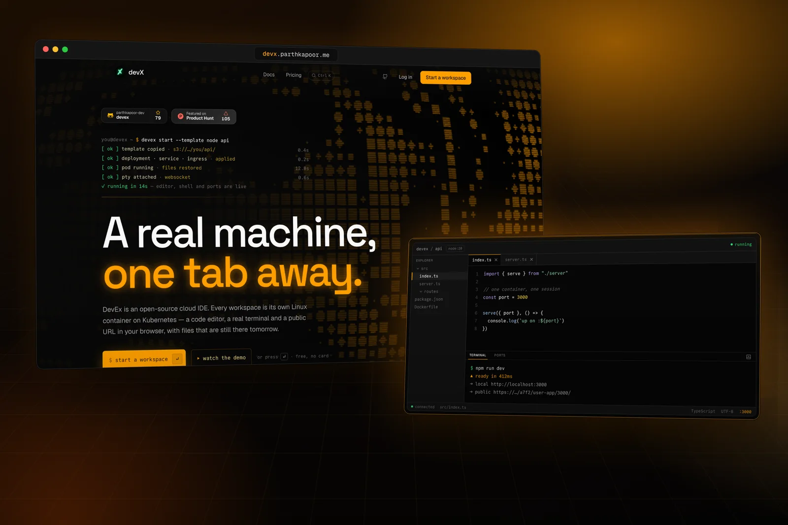

<p align="center">
  <a href="https://devx.parthkapoor.me">
    
  </a>
</p>

<h1 align="center">DevEx</h1>

<p align="center">
  <b>A real machine, one tab away.</b><br />
  An open-source cloud IDE. Every workspace is its own Linux container on Kubernetes,<br />
  with a code editor, a real terminal and a public URL — and files that are still there tomorrow.
</p>

<p align="center">
  <a href="https://devx.parthkapoor.me">Live</a>
  &nbsp;·&nbsp;
  <a href="https://devx.parthkapoor.me/docs">Docs</a>
  &nbsp;·&nbsp;
  <a href="https://discord.gg/KNPrWpKSvy">Discord</a>
  &nbsp;·&nbsp;
  <a href="https://www.youtube.com/watch?v=Tlck20bJeFE">Demo video</a>
  &nbsp;·&nbsp;
  <a href="https://www.producthunt.com/products/devex">Product Hunt</a>
</p>

<p align="center">
  <a href="https://github.com/ParthKapoor-dev/devex/actions/workflows/ci.yaml"></a>
  <a href="./LICENSE"></a>
  <a href="https://discord.gg/KNPrWpKSvy"></a>
  <a href="https://github.com/ParthKapoor-dev/devex/stargazers"></a>
</p>

---

## What you get

Pick a template, give it a name, and open it. Once its pod is up you're in a browser IDE attached to a container that is yours alone:

- **An editor** — Monaco, the engine behind VS Code, with a file explorer that creates, renames, moves and deletes on the real filesystem.
- **A terminal** — an actual PTY running `bash` inside the container, not an emulated shell. Install packages, run servers, use git.
- **A public URL for anything you start.** Run a dev server on port 3000 and it's reachable at `…/<workspace>/user-app/3000/`.
- **Files that persist.** Close the tab and the workspace sleeps; your files are saved to object storage and restored the next time you open it.

Node.js and Python templates are available today.

## How a workspace comes to life

```text
 you ── "create" ──►  core API (Go) ── copies templates/<stack>/ → your folder in the bucket

 you ── "open" ────►  core API (Go)
                                │
                                ├─ creates a Deployment, Service and Ingress on Kubernetes
                                └─ waits for the pod to answer /ping
                                          │
            ┌─────────────────────────────┘
            ▼
      workspace pod ── init container pulls your files into /workspaces
            │
            └─ runner (Go) ◄──── WebSocket ────► browser: file tree · editor · terminal
                   │
                   └─ 4 minutes after the last tab closes:
                      core copies /workspaces back to the bucket and deletes the pod
```

Traffic reaches every pod through a single Traefik ingress on `repl.parthkapoor.me/<workspace>/…`, running on the node's own network so the cluster doesn't need a paid cloud load balancer. TLS comes from cert-manager and Let's Encrypt.

The [architecture docs](https://devx.parthkapoor.me/docs/architecture) walk through each step in detail.

## Inside the repository

| Path | What lives there |
| --- | --- |
| [`apps/web`](./apps/web) | The website, docs and IDE — Next.js 15, React 19, Tailwind v4, Monaco, xterm.js |
| [`apps/core`](./apps/core) | Control-plane API in Go: GitHub and magic-link sign-in, workspace records in Redis, template copies in S3-compatible storage, Kubernetes orchestration with client-go |
| [`apps/runner`](./apps/runner) | Runs inside every workspace: the WebSocket protocol for files and terminals, the preview proxy, idle shutdown |
| [`apps/mcp`](./apps/mcp) | Optional Model Context Protocol sidecar so AI assistants can read a workspace's files |
| [`packages`](./packages) | Shared Go code: logging, JSON helpers, the protobuf contract between runner and MCP |
| [`infra`](./infra) | Dockerfiles, the Docker Swarm stack for the API, Traefik and cert-manager manifests |
| [`templates`](./templates) | Starter files copied into new workspaces |

The Go services are four modules tied together with a Go workspace (`go.work`); the web app is a standalone npm project.

## Running it locally

**The frontend** runs on its own:

```sh
cd apps/web
cp .env.example .env
npm install
npm run dev
```

**The Go services** need Go 1.24+ and `protoc`:

```sh
make proto-tools   # pinned protoc plugins
make proto         # generate packages/pb
make ci            # tidy check, build, vet and test every module, plus web lint/typecheck/tests
```

Running real workspaces needs a Kubernetes cluster, Redis and an S3-compatible bucket. [Self-hosting](https://devx.parthkapoor.me/docs/self-hosting) covers the full setup on any provider with a single public node.

## Status

DevEx is built and run by one person on a small cluster, and it's still evolving. Open problems and the order they're being tackled in are tracked in the [roadmap issue](https://github.com/ParthKapoor-dev/devex/issues/33).

Found a security problem? Please report it privately through the repository's [Security tab](https://github.com/ParthKapoor-dev/devex/security) rather than in a public issue.

## Contributing

Templates, fixes and ideas are welcome. The [contributing guide](https://devx.parthkapoor.me/docs/contributing) explains how the pieces fit, how to run the checks, and what a good pull request looks like. Pull requests go to the `develop` branch.

## Why it exists

I wanted to understand what actually happens between clicking "open" and getting a shell in the cloud — containers, orchestration, networking, TLS, persistence — so I built the whole path myself.
— [Parth Kapoor](https://parthkapoor.me)

## License

[MIT](./LICENSE)
