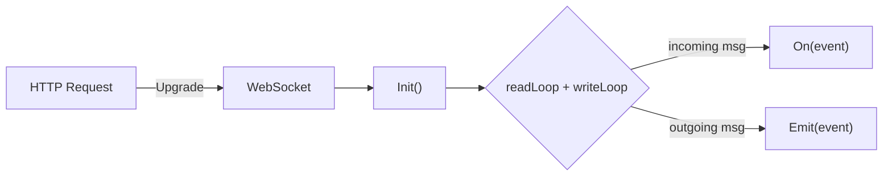

# 📡 `pkg/ws` – WebSocket Abstraction Layer

The `pkg/ws` package provides a **simple yet powerful event-driven WebSocket interface** inspired by Socket.IO, built on top of [Gorilla WebSocket](https://pkg.go.dev/github.com/gorilla/websocket).

It enables clean event registration (`On`) and message emission (`Emit`) with JSON messages using a typed message format.

---

## 🛠 Usage

To use this WebSocket handler in your own HTTP route:

```go
import (
  "net/http"
  log "packages/logging"
  "github.com/ParthKapoor-dev/devex/apps/runner/pkg/ws"
  "github.com/ParthKapoor-dev/devex/apps/runner/pkg/pty"
)

func wsHandler(w http.ResponseWriter, r *http.Request) {
  socket := ws.NewWSHandler()
  ptyManager := pty.NewPTYManager()

  err := socket.Init(w, r)
  if err != nil {
    log.Error(err)
  }

  socket.On("Connection", func(data any) {
    log.Info("Client connected")
  })

  socket.On("someEvent", func(data any) {
    // handle event
  })
}
````

---

## 📦 Features

* 🔌 `Init`: Upgrades HTTP connection to WebSocket
* 🧠 `On(event, handler)`: Register handlers for incoming events
* 📤 `Emit(event, data)`: Send structured JSON messages to client
* 🔁 Internal read/write goroutines to manage WebSocket I/O
* 🔒 Thread-safe handler registration
* 🔚 `Close()`: Gracefully closes the connection

---

## 🧱 Design Overview



* Messages are JSON with structure:

  ```json
  {
    "event": "eventName",
    "data": {}
  }
  ```

* Uses `sync.RWMutex` for thread-safe access to event handlers

* Write operations are funneled through `writeChan` to avoid race conditions

* Event callbacks are run in **separate goroutines**

---

## 📄 File Overview

> 📁 [View Source](https://github.com/ParthKapoor-dev/devex/blob/main/apps/runner/pkg/ws/ws.go)

| Function             | Description                                   |
| -------------------- | --------------------------------------------- |
| `NewWSHandler()`     | Create a new handler instance                 |
| `Init(w, r)`         | Upgrades connection and starts loops          |
| `On(event, handler)` | Register event listener                       |
| `Emit(event, data)`  | Send message to client                        |
| `readLoop()`         | Reads incoming JSON messages                  |
| `writeLoop()`        | Writes outgoing JSON messages                 |
| `triggerEvent()`     | Executes the handler for an event             |
| `Close()`            | Closes the connection                         |
| `Broadcast()`        | Alias to `Emit` (extensible for multi-client) |

---

## 📦 Structs & Types

### `Message`

The basic JSON structure exchanged over the wire.

```go
type Message struct {
  Event string `json:"event"`
  Data  any    `json:"data,omitempty"`
}
```

### `WSHandler`

The main connection manager with:

* `conn`: Gorilla WebSocket connection
* `handlers`: map of registered event callbacks
* `writeChan`: buffered write channel
* `done`: signals connection closure

---

## ✅ Example: Register & Emit

```go
ws := NewWSHandler()
ws.On("sayHello", func(data any) {
  log.Info("Client says", "data", data)
})

ws.Emit("serverReady", map[string]string{"msg": "Welcome!"})
```

---

## 🚧 Future Improvements

* Add `BroadcastGroup` support
* Heartbeat/ping-pong mechanism
* Support for `OnTyped` and JSON validation
* Add retry/backoff logic

---

## 🧭 Related Packages

* [📂 `pkg/pty`](../pty) – Manages terminal sessions
* [📂 `pkg/fs`](../fs) – Manages filesystem read/write operations
* [📂 `apps/runner/services/repl`](../../services/repl) – API integration using this handler

---

## 🔗 Source

* [Source Code – `ws.go`](https://github.com/ParthKapoor-dev/devex/blob/main/apps/runner/pkg/ws/ws.go)
